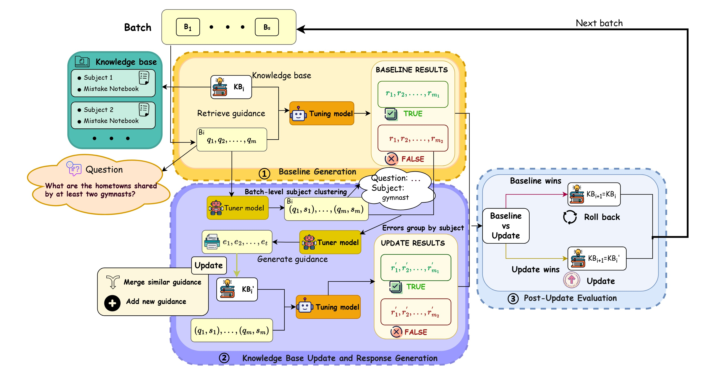
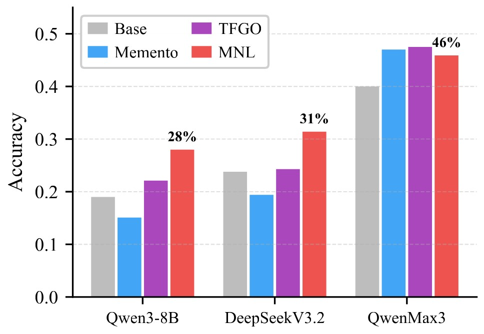
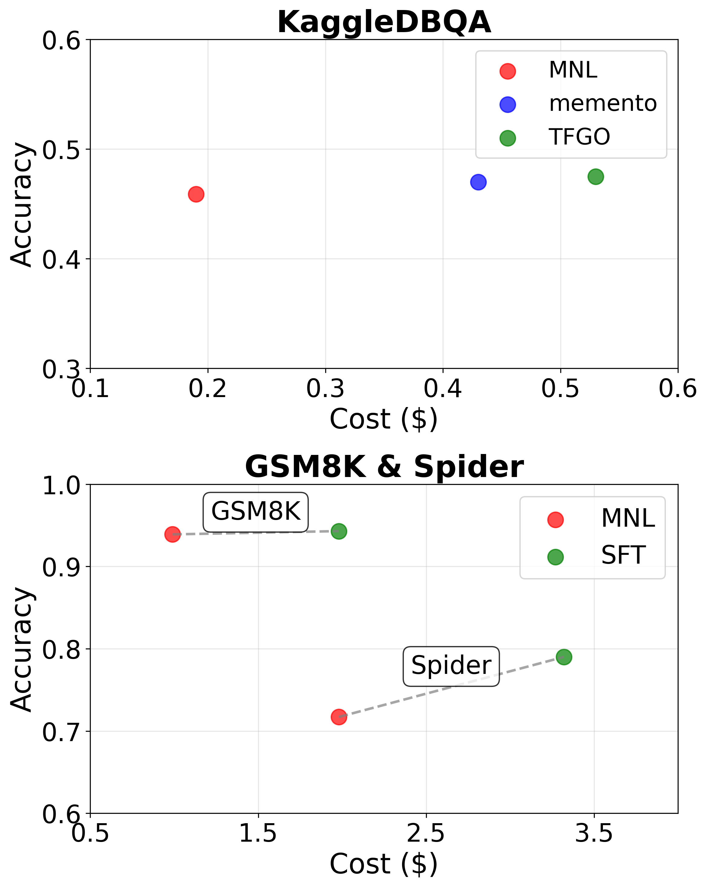
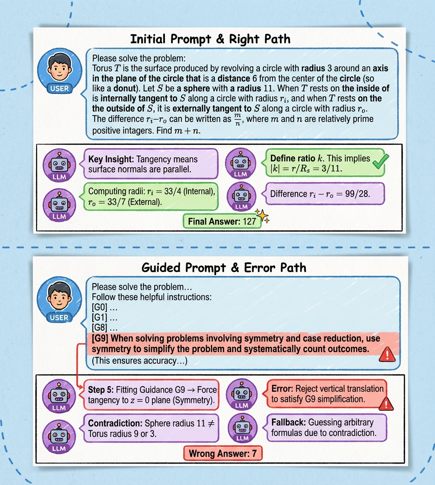
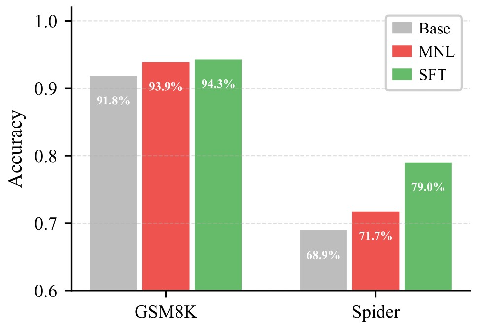

# Mistake Notebook Learning (MNL): Selective Batch-Wise Context Optimization for In-Context Learning

A training-free framework for improving Large Language Model (LLM) reasoning capabilities through structured error abstraction, batch-wise knowledge accumulation, and selective validation mechanisms.

## Abstract

Large language models adapt via gradient-based fine-tuning (costly) or in-context learning (unstable). We introduce **Mistake Notebook Learning (MNL)**, a training-free framework that bridges this gap. MNL maintains a dynamic knowledge base of error patterns extracted from **batch-wise analysis** of multiple related failures, producing generalizable subject-level guidance. Unlike memory-based methods prone to instance-level noise, MNL uses structured knowledge representation and a selective validation mechanism to ensure robust and monotonic improvement.

*Figure 1: Overview of Mistake Notebook Learning framework*

## Performance Highlights

*Figure 2: Performance on KaggleDBQA. MNL achieves 47%, 32%, and 15% relative improvements for Qwen3-8B, DeepSeekV3.2, and Qwen3-Max.*

*Figure 3: Cost-accuracy trade-off. MNL achieves competitive performance with significantly lower computational cost compared to SFT and other training-free methods.*

**Key Results:**

- **GSM8K**: MNL (93.9%) nearly matches SFT (94.3%) without any parameter updates

- **KaggleDBQA**: 47% relative improvement with Qwen3-8B, establishing MNL as a practical alternative to gradient-based adaptation

- **Cost Efficiency**: On GSM8K, MNL achieves 93.9% accuracy at only \$1.20 learning cost (40% less than SFT's \$1.99)

--- 

## Introduction

### Motivation

Current training-free adaptation methods for LLMs face two critical limitations:

**Problem 1: Instance-Level Noise**

- Single-case retrieval overfits to details.

*Figure 4: Example of instance-level noise leading to incorrect answers*

**Problem 2: Unconditional Iterative Updates**

- Greedy integration of all generated feedback leads to memory saturation with low-utility content

### Our Approach

MNL addresses these limitations through:

1. **Batch-wise Error Abstraction**: Analyze multiple related failures to extract generalizable patterns

2. **Structured Knowledge Representation**: Five-component format with explicit anti-patterns

3. **Selective Validation**: Empirical hold-out evaluation before knowledge base updates

4. **Subject-Level Clustering**: Dynamic subject classification for targeted guidance

---

## Method Overview

### Problem Formulation

We formalize the context optimization problem as constructing an optimal knowledge base $\mathcal{KB}$ and retrieving appropriate knowledge to maximize the expected reward of an LLM policy $\pi_\theta$ with frozen parameters $\theta$.

**Objective:**

$$\mathcal{KB}^* = \arg\max_{\mathcal{KB}} \mathbb{E}_{(x,y) \sim \mathcal{D}} \left[ R\left(\pi_\theta(P(x, \mathcal{KB})), y\right) \right]$$

**Knowledge Base Entry Structure:**

Each entry $e \in \mathcal{KB}$ is a structured tuple $e = \langle s, g, \phi \rangle$ comprising:

- **Subject** ($s$): Semantic topic identifier

- **Guidance** ($g$): Five-component structured content

- **Embedding** ($\phi(s)$): Dense vector representation for retrieval

### Three-Stage Learning Framework

1. **Baseline Generation**: Answer questions using current knowledge base.

2. **Update & Regeneration**: Cluster errors by subject, synthesize new guidance from batch patterns, generate new answers.

3. **Evaluation & Commit**: Compare new vs. old answers; update notebook only if batch performance improves.

## Results

### Tasks and Datasets:

- **Mathematical Reasoning:**
  - **AIME 2024/2025:** Competition-level problems (small-data regime, 100 training examples from DAPO and 30 test examples per year).
  - **GSM8K:** Grade-school math problems (large-scale, 7,473 training examples).
- **Text-to-SQL:**
  - **Spider:** Cross-domain complex SQL generation (large-scale, 7,000 training examples and 1,319 test examples).
  - **KaggleDBQA:** Real-world database QA (small-data regime, 87 training and 185 test examples).

#### Main Results

**1. Mathematical Reasoning Performance**
| Dataset | Model | Base | TFGO | **MNL (Ours)** |
| :--- | :--- | :--- | :--- | :--- |
| **AIME 2024** | Qwen3-8B | <u>0.30</u> | 0.23 | **0.33** |
| | DeepSeekV3.2 | 0.87 | **0.93** | <u>0.90</u> |
| | Qwen3-Max | **0.93** | 0.90 | **0.93** |
| **AIME 2025** | Qwen3-8B | <u>0.23</u> | <u>0.23</u> | **0.30** |
| | DeepSeekV3.2 | 0.80 | **0.90** | <u>0.83 </u>|
| | Qwen3-Max | **0.96** | 0.90 | **0.96** |
| **GSM8K** | Qwen3-8B | <u>0.918</u> | 0.912 | **0.939** |

*Table 1: Results on Mathematical Reasoning Tasks (Pass@32). Best in **bold**, second underlined.*

**Key Findings (Math):**

- MNL gives a **30% relative improvement** for Qwen3-8B on AIME 2025 (23% → 30%).
- For top models like Qwen3-Max (96%), MNL **maintains peak performance** without regression.
- On **GSM8K**, MNL achieves **93.9%**, showing strong large-scale reasoning.

**2. Text-to-SQL Performance**
| Dataset | Model | Base | Memento | TFGO | **MNL (Ours)** |
| :--- | :--- | :--- | :--- | :--- | :--- |
| **KaggleDBQA** | Qwen3-8B | 0.190 | 0.151 | <u>0.221</u> | **0.280** |
| | DeepSeekV3.2 | 0.238 | 0.194 | <u>0.243</u> | **0.314** |
| | Qwen3-Max | 0.400 | <u>0.470</u> | **0.475** | 0.459 |
| **Spider** | Qwen3-8B | 0.689 | 0.673 | <u>0.701</u> | **0.717** |

*Table 2: Results on Text-to-SQL Tasks (Execution Accuracy, Pass@1). Best in **bold**, second underlined.*

**Key Findings (Text-to-SQL):**

- On **KaggleDBQA**, MNL brings **47% relative improvement** for Qwen3-8B (19.0% → 28.0%).
- On **Spider**, MNL raises Qwen3-8B to **71.7%**, leading all training-free baselines.

### Comparison with Supervised Fine-Tuning (SFT)

*Figure 5:MNL vs.\ SFT on Qwen3-8B. On GSM8K, MNL (93.9\%) nearly matches SFT (94.3\%). On Spider, SFT (79.0\%) leads, but MNL (71.7\%) significantly improves over base (68.9\%) without parameter updates.*

A central finding is that MNL's systematic context curation can rival gradient-based adaptation, see figure 5. We compare against full-parameter SFT on Qwen3-8B:

- **GSM8K:** MNL (**93.9%**) nearly matches SFT (**94.3%**), only 0.4 points behind.
- **Spider:** SFT leads (**79.0%**), but MNL (**71.7%**) significantly improves over the vanilla model (**68.9%**) **without parameter updates**.

### Cost-Effectiveness Analysis

MNL delivers high performance per cost (see Figure 2):

- **KaggleDBQA (Qwen3-Max):** MNL reaches **0.459 accuracy at only $0.19**.

- **vs. SFT on Qwen3-8B:**
  
  - **GSM8K:** MNL (93.9%, $0.99) closes most of the gap to SFT (94.3%, \$1.98), **cutting cost by ~50%**.
  
  - **Spider:** MNL (71.7%, $1.98) gives major gains, while SFT (79.0%, \$3.32) is more costly.

**Conclusion:** MNL gives **competitive performance** across tasks, offers **major cost savings** over gradient methods, and works well in **self-tuning mode**, making it a versatile and efficient LLM adaptation approach.

## Code Availability

We are currently organizing and refactoring the codebase.  
The full implementation will be released soon.