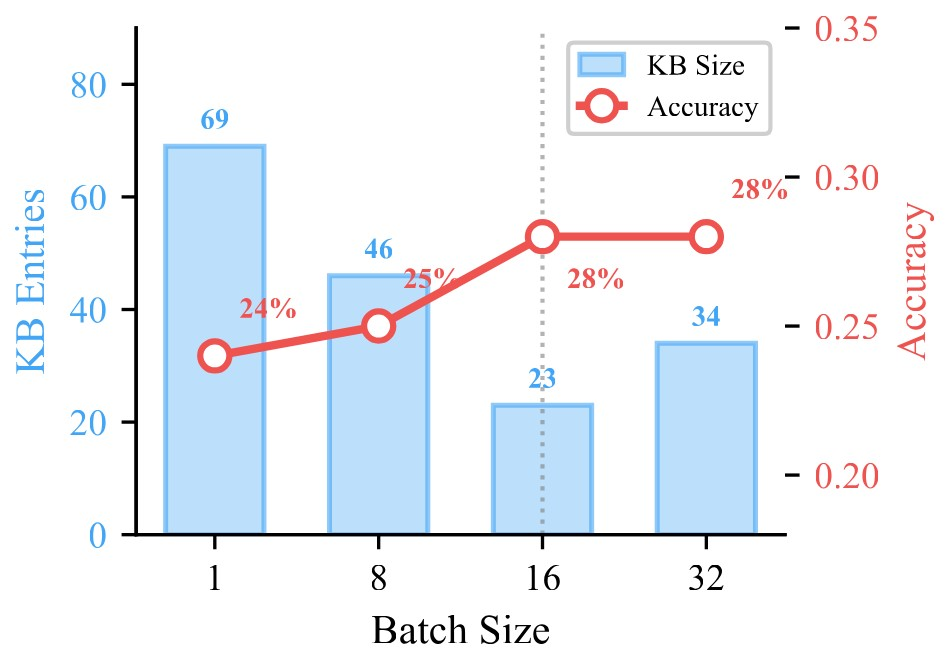
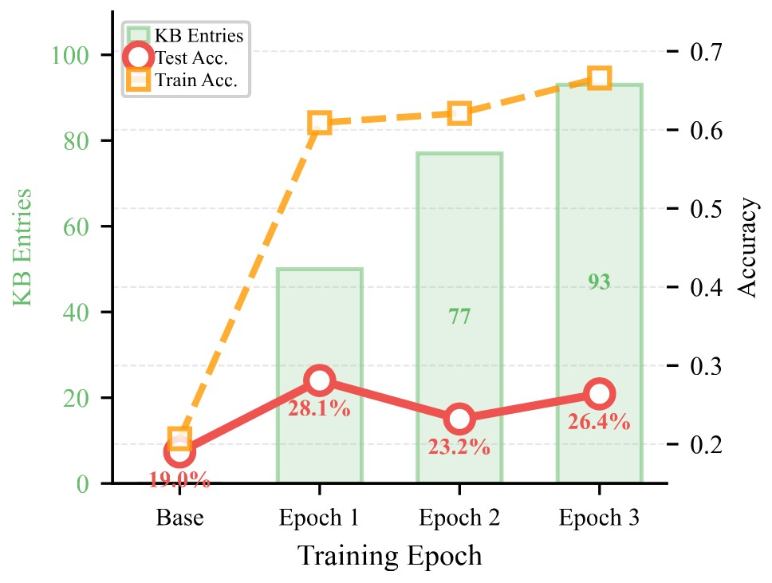

# Mistake Notebook Learning (MNL): Selective Batch-Wise Context Optimization for In-Context Learning

A training-free framework for improving Large Language Model (LLM) reasoning capabilities through structured error abstraction, batch-wise knowledge accumulation, and selective validation mechanisms.

## Abstract

Large language models (LLMs) typically adapt to specific tasks through gradient-based fine-tuning or training-free In-Context Learning (ICL). Although fine-tuning achieves strong performance, it requires substantial computation and risks catastrophic forgetting. ICL provides a lightweight alternative, yet often lacks robustness due to its sensitivity to case selection and its inability to systematically learn from mistakes.

To overcome these limitations, we introduce **Mistake Notebook Learning (MNL)**, a training-free framework that bridges this gap by maintaining a persistent and continually learned knowledge base of abstracted error patterns. Unlike prior memory-based methods that rely on instance-level or single-trajectory processing, MNL performs **batch-wise error abstraction**: it analyzes multiple related failures to extract generalizable, subject-level guidance and organizes these insights in a dynamically updated notebook.

*Figure 1: Overview of Mistake Notebook Learning framework*

## Key Features

- **Structured Knowledge Representation**: Five-component structured format for mistake notebook entries (corrected examples, correct approach, mistake summary, generalizable strategy, and anti-patterns)

- **Batch-wise Error Abstraction**: Aggregates error patterns across multiple related failures to reduce instance-level noise

- **Selective Update Mechanism**: Validates candidate updates through empirical hold-out evaluation before committing to knowledge base

- **Training-Free Adaptation**: Improves LLM performance without modifying model parameters

## Performance Highlights


*Figure 2: Performance on KaggleDBQA. MNL achieves 47%, 32%, and 15% relative improvements for Qwen3-8B, DeepSeekV3.2, and Qwen3-Max.*


*Figure 3: Cost-accuracy trade-off. MNL achieves competitive performance with significantly lower computational cost compared to SFT and other training-free methods.*

**Key Results:**

- **GSM8K**: MNL (93.9%) nearly matches SFT (94.3%) without any parameter updates

- **KaggleDBQA**: 47% relative improvement with Qwen3-8B, establishing MNL as a practical alternative to gradient-based adaptation

- **Cost Efficiency**: On GSM8K, MNL achieves 93.9% accuracy at only \$1.20 learning cost (40% less than SFT's \$1.99)

---

## Table of Contents

1. [Introduction](#introduction)

2. [Method Overview](#method-overview)

3. [Core Components](#core-components)

4. [Implementation](#implementation)

5. [Installation](#installation)

6. [Usage](#usage)

7. [Results](#results)

8. [Contributing](#contributing)

9. [License](#license)

---

## Introduction

### Motivation

Current training-free adaptation methods for LLMs face two critical limitations:

**Problem 1: Instance-Level Noise**

- Memory-augmented methods suffer from instance-level noise

- Cosine similarity retrieval may overfit to trajectory details

- Single-query retrieval struggles to capture cross-task patterns

- Risk of misapplying experiences to structurally similar but semantically distinct problems


*Figure 4: Example of instance-level noise leading to incorrect answers*

**Problem 2: Unconditional Iterative Updates**

- Iterative refinement methods lack rigorous acceptance criteria for proposed updates

- Greedy integration of all generated feedback leads to memory saturation with low-utility content

- Loss of ability to correct errors retroactively, resulting in premature performance stagnation

### Our Approach

MNL addresses these limitations through:

1. **Batch-wise Error Abstraction**: Analyze multiple related failures to extract generalizable patterns

2. **Structured Knowledge Representation**: Five-component format with explicit anti-patterns

3. **Selective Validation**: Empirical hold-out evaluation before knowledge base updates

4. **Subject-Level Clustering**: Dynamic subject classification for targeted guidance

---

## Method Overview

### Problem Formulation

We formalize the context optimization problem as constructing an optimal knowledge base $\mathcal{KB}$ and retrieving appropriate knowledge to maximize the expected reward of an LLM policy $\pi_\theta$ with frozen parameters $\theta$.

**Objective:**

$$\mathcal{KB}^* = \arg\max_{\mathcal{KB}} \mathbb{E}_{(x,y) \sim \mathcal{D}} \left[ R\left(\pi_\theta(P(x, \mathcal{KB})), y\right) \right]$$

**Knowledge Base Entry Structure:**

Each entry $e \in \mathcal{KB}$ is a structured tuple $e = \langle s, g, \phi \rangle$ comprising:

- **Subject** ($s$): Semantic topic identifier

- **Guidance** ($g$): Five-component structured content

- **Embedding** ($\phi(s)$): Dense vector representation for retrieval

### Three-Stage Learning Framework

#### Stage 1: Baseline Generation

- Retrieve relevant guidance from $\mathcal{KB}$ using question-to-subject semantic retrieval

- Generate baseline responses with current knowledge base

- Establish performance reference for each query

#### Stage 2: Knowledge Base Update and Response Generation

- Perform batch-level subject clustering

- Analyze baseline errors grouped by subject

- Synthesize structured guidance from aggregated error patterns

- Generate updated responses with candidate knowledge base

#### Stage 3: Post-Update Evaluation

- Compare baseline results with updated results

- Accept update only when aggregated batch reward improves

- Ensure monotonic performance improvement

---

## Core Components

### 1. Structured Knowledge Representation

Each knowledge base entry contains five essential components:

```
1. Corrected Examples

   - Original question and mistake answer

   - Correct answer and reasoning process


2. Correct Approach

   - Step-by-step reasoning methodology

   - Proper solution technique


3. Mistake Summary

   - Root cause analysis of error patterns

   - Identification of reasoning flaws


4. Generalizable Strategy

   - Reusable problem-solving principles

   - Transferable learning patterns


5. Anti-Patterns (Critical Component)

   - Common misapplication scenarios

   - Situations where guidance should NOT be applied

   - Red flags indicating inapplicability
```

### 2. Batch-Wise Error Abstraction

Unlike instance-level methods, MNL processes errors at the **subject level**:

- **Subject Clustering**: Questions are dynamically clustered into coherent subjects

- **Error Aggregation**: Multiple related failures within each subject are analyzed together

- **Pattern Extraction**: Generalizable patterns are extracted from aggregated errors

- **Noise Reduction**: Batch-level processing reduces instance-level noise

### 3. Selective Update Mechanism

MNL implements a validation-gated update rule:

- **Candidate Evaluation**: Proposed updates are tested on the entire batch

- **Win-Rate Comparison**: Compare performance before and after update

- **Selective Acceptance**: Update committed only if net positive improvement

- **Monotonic Guarantee**: Ensures performance never decreases

---

## Implementation

### Algorithm Overview

```python
def mistake_notebook_learning(D_train, batch_size, tuning_model, tuner_model, reward_func):

    KB = initialize_knowledge_base()

    for batch in D_train.batches(batch_size):

        # Stage 1: Baseline Inference

        baseline_responses = []

        for question in batch:

            retrieved_guidance = KB.retrieve(question)

            response = tuning_model(question, retrieved_guidance)

            baseline_responses.append(response)

        # Stage 2: Knowledge Base Update

        subjects = batch_cluster_subjects(batch, tuner_model)

        error_subjects = identify_error_subjects(batch, baseline_responses, reward_func)

        candidate_KB = KB.copy()

        for subject in error_subjects:

            error_patterns = abstract_patterns(subject_errors, tuner_model)

            new_guidance = generate_guidance(error_patterns, tuner_model)

            merged_guidance = rag_merge(new_guidance, KB.retrieve(subject), tuner_model)

            candidate_KB.update(subject, merged_guidance)

        # Stage 3: Selective Update

        updated_responses = generate_with_candidate_KB(batch, candidate_KB, tuning_model)

        improvement = calculate_improvement(baseline_responses, updated_responses, reward_func)

        if improvement > 0:

            KB = candidate_KB  # Accept update

    return KB
```

### 

## Results

### Experimental Setup

We evaluate MNL across four challenging benchmarks, stratified by **task type** (mathematical reasoning vs. text-to-SQL) and **data scale** (small vs. large), to comprehensively assess its capabilities.

**Tasks and Datasets:**

- **Mathematical Reasoning:**
  - **AIME 2024/2025:** Competition-level problems (small-data regime, 100 training examples from DAPO and 30 test examples per year).
  - **GSM8K:** Grade-school math problems (large-scale, 7,473 training examples).
- **Text-to-SQL:**
  - **Spider:** Cross-domain complex SQL generation (large-scale, 7,000 training examples and 1,319 test examples).
  - **KaggleDBQA:** Real-world database QA (small-data regime, 87 training and 185 test examples).

**Base Models:** We test across capability tiers:

- **Qwen3-8B** (open-weight, 8B)
- **DeepSeekV3.2-Exp** (frontier-scale, proprietary)
- **Qwen3-Max** (frontier-scale, proprietary)

**Evaluation Protocol:** We report Pass@32 accuracy for math (exact match) and execution accuracy (Pass@1) for Text-to-SQL under greedy decoding (temperature 0.0). All experiments use single-epoch training, batch size 16, and a presence penalty of 1.5.

### Main Results

**1. Mathematical Reasoning Performance**
| Dataset | Model | Base | TFGO | **MNL (Ours)** |
| :--- | :--- | :--- | :--- | :--- |
| **AIME 2024** | Qwen3-8B | <u>0.30</u> | 0.23 | **0.33** |
| | DeepSeekV3.2 | 0.87 | **0.93** | <u>0.90</u> |
| | Qwen3-Max | **0.93** | 0.90 | **0.93** |
| **AIME 2025** | Qwen3-8B | <u>0.23</u> | <u>0.23</u> | **0.30** |
| | DeepSeekV3.2 | 0.80 | **0.90** | <u>0.83 </u>|
| | Qwen3-Max | **0.96** | 0.90 | **0.96** |
| **GSM8K** | Qwen3-8B | <u>0.918</u> | 0.912 | **0.939** |

*Table 1: Results on Mathematical Reasoning Tasks (Pass@32). Best in **bold**, second underlined.*

**Key Findings (Math):**

- On the challenging **AIME 2025**, MNL brings a **30% relative improvement** for Qwen3-8B (23% → 30%).
- Even for near-saturated frontier models (Qwen3-Max at 96%), MNL **maintains peak performance without regression**, validating the stability of our selective update mechanism.
- On **GSM8K**, MNL achieves strong performance (**93.9%**), demonstrating effectiveness on large-scale reasoning tasks.

**2. Text-to-SQL Performance**
| Dataset | Model | Base | Memento | TFGO | **MNL (Ours)** |
| :--- | :--- | :--- | :--- | :--- | :--- |
| **KaggleDBQA** | Qwen3-8B | 0.190 | 0.151 | <u>0.221</u> | **0.280** |
| | DeepSeekV3.2 | 0.238 | 0.194 | <u>0.243</u> | **0.314** |
| | Qwen3-Max | 0.400 | <u>0.470</u> | **0.475** | 0.459 |
| **Spider** | Qwen3-8B | 0.689 | 0.673 | <u>0.701</u> | **0.717** |

*Table 2: Results on Text-to-SQL Tasks (Execution Accuracy, Pass@1). Best in **bold**, second underlined.*

**Key Findings (Text-to-SQL):**

- On the low-resource **KaggleDBQA**, MNL yields a **47% relative improvement** for Qwen3-8B (19.0% → 28.0%) and **32%** for DeepSeekV3.2 (23.8% → 31.4%), demonstrating exceptional efficacy in small-data regimes.
- On the large-scale **Spider** benchmark, MNL elevates Qwen3-8B to **71.7%** execution accuracy, outperforming all other training-free baselines.

### Comparison with Supervised Fine-Tuning (SFT)


*Figure 5:MNL vs.\ SFT on Qwen3-8B. On GSM8K, MNL (93.9\%) nearly matches SFT (94.3\%). On Spider, SFT (79.0\%) leads, but MNL (71.7\%) significantly improves over base (68.9\%) without parameter updates.*

A central finding is that MNL's systematic context curation can rival gradient-based adaptation, see figure 5. We compare against full-parameter SFT on Qwen3-8B:

- **On GSM8K:** MNL (**93.9%**) achieves near-parity with SFT (**94.3%**), trailing by only **0.4 percentage points**.
- **On Spider:** While SFT leads (**79.0%**), MNL (**71.7%**) still delivers a substantial **+2.8 point improvement** over the base model (**68.9%**) **without any parameter updates**.

*This demonstrates that in resource-constrained settings where gradient-based fine-tuning is infeasible, MNL provides a powerful and practical alternative, closing most of the performance gap at a fraction of the cost.*

### Ablation Studies & Analysis

**1. Effect of Batch Size on Variance Reduction**


*Figure 6: Effect of batch size on KaggleDBQA. Batch size 16 achieves optimal balance: 28\% accuracy with only 23 KB entries vs.\ 24\% accuracy with 69 entries at batch size 1.*

Our core hypothesis is that batch-level abstraction reduces guidance noise. Experiments on KaggleDBQA (Qwen3-8B) confirm this（see Figure 6）:

- Increasing batch size from **1** (instance-level) to **16** improves accuracy from **24.0% to 28.0%** (a **17% relative gain**).
- This improvement comes with a **three-fold reduction** in knowledge base size (**69 entries → 23 entries**), proving batch aggregation distills noisy instances into fewer, more general principles.
- Performance saturates at batch size 16, indicating an optimal balance between abstraction and specificity.

**2. Effect of Training Epochs: The Overfitting Phenomenon**



*Figure 7：Effect of training epochs on KaggleDBQA. Single-epoch achieves optimal test accuracy (28.1\%) with 50 KB entries. Multiple epochs cause cross-epoch overfitting: test accuracy drops to 23.2\% at epoch 2 while training accuracy rises to 62.1\%, demonstrating the knowledge base overfits to training patterns.*

Contrary to parameter-based training, multiple passes over data in context optimization lead to overfitting（see Figure 7）:

- **Single-epoch training yields the highest test performance** (28.1% on KaggleDBQA).
- By **epoch 2**, training accuracy rises (62.1%) but test accuracy **plummets to 23.2%**, and the knowledge base grows from 50 to 77 entries.
- This highlights a fundamental distinction: selective updates prevent within-epoch regression but **cannot prevent cross-epoch overfitting** to training-specific patterns.
- Consequently, we adopt **single-epoch training as the default**, analogous to early stopping.

**3. Self-Tuning vs. Cross-Model Tuning**
We investigate whether a stronger external "tuner" model is necessary:

- **Cross-Model Tuning** (using DeepSeekV3.2 as the tuner for Qwen3-8B) achieves **higher performance** on KaggleDBQA (**31.0% vs. 28.0%**), confirming that stronger tuners can generate more effective guidance.
- However, **Self-Tuning** (the target model tunes itself) remains highly competitive, proving models can effectively diagnose and correct their own characteristic failures. This makes MNL practical even when only the target model is available.

### Cost-Effectiveness Analysis

MNL provides exceptional performance per unit cost compared to other methods（see Figure 2）:

- **On KaggleDBQA (Qwen3-Max):** MNL achieves **0.459 accuracy at a total learning cost of only \$0.19**. 
  
  In comparison:
  - Memento costs more than double (\$0.43) for a smaller gain.
  - TFGO incurs the highest cost (\$0.53) for comparable accuracy (0.475).
- **vs. SFT on Qwen3-8B:**
  - **GSM8K:** MNL (93.9%, \$0.99, 15 mins) closes almost the entire gap to SFT (94.3%, \$1.98, 30 mins), **reducing cost by ~50%**.
  - **Spider:** MNL (71.7%, \$1.98, 30 mins) provides significant improvement over the base model, while SFT (79.0%, \$3.32, 50 mins) comes at a higher computational premium.

**Conclusion:** MNL consistently delivers **superior or competitive performance** across tasks and model scales, offers **significant cost savings** over gradient-based methods, and remains highly effective even in **self-tuning mode**, making it a versatile and efficient approach for LLM adaptation.


## Code Availability

We are currently organizing and refactoring the codebase.  
The full implementation will be released soon.